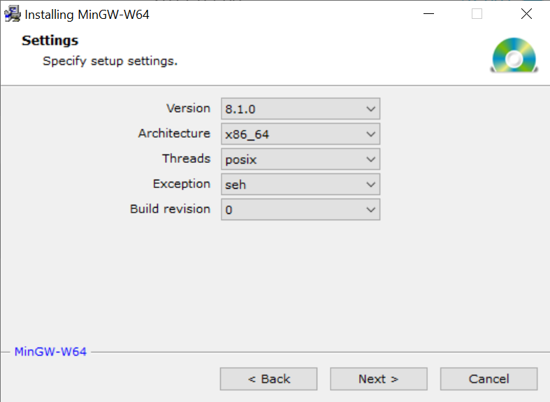

# ENGR101-Project-3
Github for team project 3 for ENGR101

## TEAM 3 PROJECT PLAN.

#### User info and roles:

[Project Manager]
RN: Sam Milburn, UN: milbursamu, ID: 300509843, E: sammilburn1916@gmail.com,
GitHub: the-hacker-known-as-anonymous

[Software Architect]
RN: Reilly Oldham UN: oldhamreil, ID: 300534051, E: oldhamreil@myvuw.ac.nz, 
Github: ProRedCat

[Developer]
RN: Tyler Andrews, UN: andrewtyle, ID: 300425252, E: tyler.andrews.home@gmail.com, 
GitHub: Got-any-pizza

[Developer]
RN: Joud Asfari, UN: asfarijoud, ID: 300448284, E: joudzasfari@gmail.com, 
GitHub: cucumber-turtle

#### Plan Timeline

| Date | Objectives | Due date | Item due | Conflicts | Tasks|
| --- | --- | --- | --- | --- | --- |
| ... | Starting and planning of the project. | 4th June | Testing code | COMP112 6-7 or 7. | | [All] Complete AVC plan   \n
Sam M - SFML install testing. Write test cases for the team.
Sam M- Ensures Plan is done. Help to install SFML for the team.
Reilly- Ensure Robot is built.
Reilly- Get/save pictures from the input. |
|4th June| Efficiently and uniformly implementing Robot behaviour to specifications. | 11th June | Core & Completion code | CONFLICTS HERE... |
[ALL] Uniform input and effort.
Reilly - General structure and algorithm building.
Sam - Organizing progress and sorting the documentation. 
Tyler - documenting and recording progress, extending algorithmic work.
Joud - documenting and recording progress, extending algorithmic work. |
| 11th June | Project functionality & completion | 17th June | Challenge Code | CONFLICTS HERE... |
[ALL]
Working on completeness of the project for all specifications.
Reilly - extending algorithmic functionality.
Sam - Ensuring completeness of the project and conclusion.
Tyler - Implementing further functionality.
Joud - Implementing further functionality. |  
| 17th June | Report write-up| 19th June | Report | CONFLICTS HERE... | 
[ALL] Writing report collectively through discord. |

## Guide to installation and running the Project.

#### Step (1)
Install SFML from: https://www.sfml-dev.org/download/sfml/2.5.1/  
Choose GCC 7.3.0 MinGW (SEH) 64 bit, and extract into C: drive, then rename the file to SFML. 

##### Note: SFML must be extracted to the C: drive and renamed to SFML, as the project MakeFile has the SFML directory as c:\\SFML
##### If you place the SFML in a different directory, you should change the DIR in MakeFile to the directory of your SFML folder. 

#### Step (2)
Install MinGW-W64 from: https://sourceforge.net/projects/mingw-w64/files/ 
You can extract the MinGW-W64 file anywhere you want. When specifying the set up settings, you must make sure that you install MinGW version 8.1.0, architecture x86_64, threads posix, exception SEH, built revision 0. Choosing the right settings is very important!

#### Step (3)
Open the MinGW file, then open the bin file inside it. Copy the directory.

#### Step (4)
Search “environment variables” on Windows start, and click “edit the system environment variables”. Click “environment variables” from the bottom right of the opened window. Look for the “path” variable from your user variables, then click “edit”. Now you have to click “new” and paste the directory of the MinGW bin file. Press ok on all windows.

#### Step (5)
To download the needed files, go to the branch master and press the green “clone or download” button at the top right of the repository page, then download as zip. Extract the zip into a folder.

#### Step (6)
Open Geany. If you don’t have it installed then download it from here: https://www.geany.org/
Press on the arrow next to the “build” button. At the bottom there will be an option to set build commands. Press that and change all the independent commands to start with mingw32-

#### Step (7)
Restart your computer.

#### Step (8)
Open server3.cpp in a Geany window, and robot.cpp in a separate Geany window. Click on the arrow next to the “build” button and press “make all” to compile the code (or do shift-F9). Do this on both files. Execute server3.cpp first (using the button next to the build button, or press F5), and then execute robot.cpp.  

#### Step (9)
If you want to change the maze, open the config.txt file in AVC_Server and change to “challenge.txt”, “completion.txt”, or “core.txt”. Do NOT change anything else in this file.
